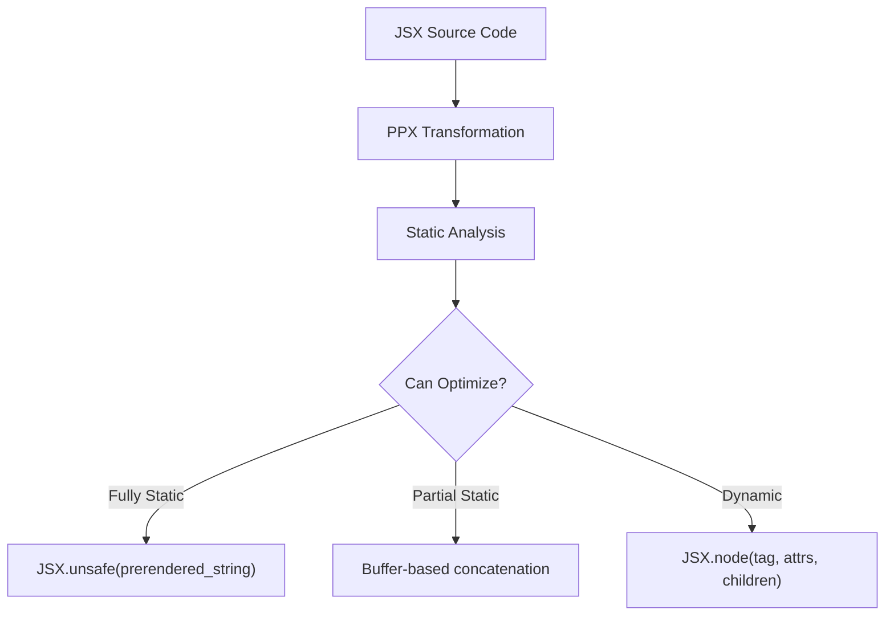

# Static Analysis Optimizations for JSX-to-HTML PPX

This document explains the compile-time optimizations implemented in `html_of_jsx` that allow prerendering of static HTML at compile time, significantly improving runtime performance.

---

## Architecture Overview



---

## 1. Core Optimization Strategy

The optimization works by analyzing JSX elements at compile time and classifying them into:

| Classification | Generated Code | Performance |
|----------------|----------------|-------------|
| `Fully_static` | Single string literal | Best - zero runtime allocation |
| `Needs_string_concat` | Buffer with string parts | Good - single buffer allocation |
| `Needs_buffer` | Buffer with mixed parts | Moderate - buffer + element writes |
| `Cannot_optimize` | `JSX.node(...)` call | Baseline - full runtime processing |

---

## 2. Static Part Types

Define an ADT representing what can appear in HTML output:

```ocaml
type static_part =
  | Static_str of string       (* Known at compile time *)
  | Dynamic_string of expression (* Runtime string, needs escaping *)
  | Dynamic_int of expression    (* Runtime int, no escaping needed *)
  | Dynamic_float of expression  (* Runtime float, no escaping needed *)
  | Dynamic_element of expression (* Full JSX element, runtime render *)
```

**Key insight**: Integers and floats never need HTML escaping (no `<>&'"` chars), so they can use `Int.to_string`/`Float.to_string` directly without `escape`.

---

## 3. Coalescing Adjacent Static Parts

Adjacent static strings are merged at compile time:

```ocaml
let rec coalesce_static_parts = function
  | Static_str a :: Static_str b :: rest ->
      coalesce_static_parts (Static_str (a ^ b) :: rest)
  | x :: rest -> x :: coalesce_static_parts rest
  | [] -> []
```

This turns `["<div>", "Hello", "</div>"]` into `["<div>Hello</div>"]`.

---

## 4. Compile-Time HTML Escaping

For static content, escape at compile time (zero runtime cost):

```ocaml
let escape_html s =
  let len = String.length s in
  let buf = Buffer.create (len * 2) in
  for i = 0 to len - 1 do
    match s.[i] with
    | '&' -> Buffer.add_string buf "&amp;"
    | '<' -> Buffer.add_string buf "&lt;"
    | '>' -> Buffer.add_string buf "&gt;"
    | '\'' -> Buffer.add_string buf "&apos;"
    | '"' -> Buffer.add_string buf "&quot;"
    | c -> Buffer.add_char buf c
  done;
  Buffer.contents buf
```

---

## 5. Literal Extraction Functions

Extract compile-time constants from AST expressions:

### String Literals

```ocaml
let rec extract_literal_string expr =
  match expr.pexp_desc with
  | Pexp_constant (Pconst_string (s, _, _)) -> Some s
  | Pexp_constraint (inner, _) -> extract_literal_string inner
  | _ -> None
```

### Integer Literals

```ocaml
let rec extract_literal_int expr =
  match expr.pexp_desc with
  | Pexp_constant (Pconst_integer (s, _)) -> Some (int_of_string s)
  | Pexp_constraint (inner, _) -> extract_literal_int inner
  | _ -> None
```

### Boolean Literals

```ocaml
let rec extract_literal_bool expr =
  match expr.pexp_desc with
  | Pexp_construct ({ txt = Lident "true"; _ }, None) -> Some true
  | Pexp_construct ({ txt = Lident "false"; _ }, None) -> Some false
  | Pexp_constraint (inner, _) -> extract_literal_bool inner
  | _ -> None
```

### JSX Helper Calls (e.g., `JSX.string("hello")`)

```ocaml
let extract_jsx_string_arg expr =
  match expr.pexp_desc with
  | Pexp_apply
      ( { pexp_desc = Pexp_ident { txt = Ldot (Lident "JSX", ("text" | "string")); _ }; _ },
        [ (Nolabel, arg) ] )
  | Pexp_apply
      ( { pexp_desc = Pexp_ident { txt = Lident ("text" | "string"); _ }; _ },
        [ (Nolabel, arg) ] ) ->
      Some arg
  | _ -> None
```

Similar extractors exist for `JSX.int`, `JSX.float`, and `JSX.unsafe`.

---

## 6. Attribute Analysis

### Attribute Value Types

```ocaml
type static_attr_value =
  | Static_string of string
  | Static_int of int
  | Static_bool of bool
```

### Attribute Render Info

```ocaml
type attr_render_info = {
  html_name : string;    (* The actual HTML attribute name *)
  is_boolean : bool;     (* Boolean attrs render differently *)
  kind : Html_attributes.kind;  (* String | Int | Bool | BooleanishString | Style *)
}
```

### Parsed Attribute Types

```ocaml
type parsed_attr =
  | Static_attr of attr_render_info * static_attr_value  (* class="foo" *)
  | Optional_attr of attr_render_info * expression       (* ?disabled=x *)
  | Dynamic_attr of string * expression                  (* id={dynamic} *)
```

### Attribute Classification Result

```ocaml
type attrs_analysis =
  | All_static of string           (* All attrs pre-rendered to string *)
  | Has_optional of (attr_render_info * expression) list * string
  | Has_dynamic                    (* Fall back to runtime *)
  | Validation_failed              (* Invalid attribute name *)
```

### Static Attribute Rendering

```ocaml
let render_static_attr_with_info info value =
  match value with
  | Static_bool false when info.is_boolean -> ""  (* omit entirely *)
  | Static_bool true when info.is_boolean -> " " ^ info.html_name  (* just name *)
  | _ ->
      let value_str = render_attr_value value in
      Printf.sprintf " %s=\"%s\"" info.html_name value_str
```

### Attribute Analysis Function

```ocaml
let analyze_attribute ~tag_name (label, expr) : attr_analysis_result =
  match label with
  | Nolabel -> Ok None (* Children, handled separately *)
  | Optional name -> (
      match validate_attr_for_static ~tag_name name with
      | Invalid_attr -> Invalid
      | Valid_attr info -> Ok (Some (Optional_attr (info, expr))))
  | Labelled name -> (
      match validate_attr_for_static ~tag_name name with
      | Invalid_attr -> Invalid
      | Valid_attr info -> (
          match extract_static_attr_value expr with
          | Some value -> Ok (Some (Static_attr (info, value)))
          | None -> Ok (Some (Dynamic_attr (info.html_name, expr)))))
```

---

## 7. Children Analysis

### Children Classification

```ocaml
type children_analysis =
  | No_children                      (* Self-closing or empty *)
  | All_static_children of string    (* All children are literals *)
  | All_string_dynamic of static_part list  (* Dynamic but escapable strings/ints *)
  | Mixed_children of static_part list      (* Contains JSX elements *)
```

### Child Analysis Logic

```ocaml
let analyze_child (expr : expression) : static_part =
  (* Priority order - check each extraction method *)
  List.find_map (fun fn -> fn ()) [
    (* JSX.unsafe("...") - no escaping, inject raw *)
    (fun () -> extract_jsx_unsafe_literal expr
               |> Option.map (fun s -> Static_str s));
    (* JSX.string("literal") - escape at compile time *)
    (fun () -> extract_jsx_text_literal expr
               |> Option.map (fun s -> Static_str (escape_html s)));
    (* Raw string literal - escape at compile time *)
    (fun () -> extract_literal_string expr
               |> Option.map (fun s -> Static_str (escape_html s)));
    (* JSX.int(42) - static, no escape needed *)
    (fun () -> extract_jsx_int_literal expr
               |> Option.map (fun i -> Static_str (string_of_int i)));
    (* JSX.float(3.14) - static, no escape needed *)
    (fun () -> extract_jsx_float_literal expr
               |> Option.map (fun f -> Static_str (Float.to_string f)));
    (* JSX.string(var) - dynamic, needs runtime escape *)
    (fun () -> extract_jsx_string_arg expr
               |> Option.map (fun e -> Dynamic_string e));
    (* JSX.int(var) - dynamic, no escape needed *)
    (fun () -> extract_jsx_int_arg expr
               |> Option.map (fun e -> Dynamic_int e));
    (* JSX.float(var) - dynamic, no escape needed *)
    (fun () -> extract_jsx_float_arg expr
               |> Option.map (fun e -> Dynamic_float e));
  ]
  |> Option.value ~default:(Dynamic_element expr)
```

### Analyze Children Function

```ocaml
let analyze_children children =
  match children with
  | None -> No_children
  | Some [] -> No_children
  | Some children ->
      let parts = List.map analyze_child children in
      let all_static = List.for_all (function Static_str _ -> true | _ -> false) parts in
      let has_element_dynamic = List.exists (function Dynamic_element _ -> true | _ -> false) parts in
      if all_static then (
        (* Concat all static strings *)
        let buf = Buffer.create 128 in
        List.iter (function Static_str s -> Buffer.add_string buf s | _ -> ()) parts;
        All_static_children (Buffer.contents buf))
      else if not has_element_dynamic then
        All_string_dynamic (coalesce_static_parts parts)
      else
        Mixed_children (coalesce_static_parts parts)
```

---

## 8. Element Analysis - The Main Decision Point

### Element Analysis Result

```ocaml
type element_analysis =
  | Fully_static of string           (* Pre-render entire HTML string *)
  | Needs_string_concat of static_part list  (* Buffer-based string concat *)
  | Needs_buffer of static_part list         (* Has dynamic elements needing JSX.write *)
  | Cannot_optimize                          (* Use JSX.node runtime *)
```

### Main Analysis Function

```ocaml
let analyze_element ~tag_name ~attrs ~children =
  let attrs_result = analyze_attributes ~tag_name attrs in
  let children_result = analyze_children children in

  match (attrs_result, children_result) with
  (* Cannot optimize cases *)
  | Validation_failed, _ -> Cannot_optimize
  | Has_dynamic, _ -> Cannot_optimize
  | Has_optional _, _ -> Cannot_optimize  (* Optional attrs need runtime logic *)

  (* Self-closing tags with static attrs *)
  | All_static attrs_html, No_children when is_self_closing_tag tag_name ->
      let html = Printf.sprintf "<%s%s />" tag_name attrs_html in
      Fully_static html

  (* Regular tags with static attrs, no children *)
  | All_static attrs_html, No_children ->
      let html = Printf.sprintf "<%s%s></%s>" tag_name attrs_html tag_name in
      Fully_static html

  (* Static attrs + static children = fully static *)
  | All_static attrs_html, All_static_children children_html ->
      let html = Printf.sprintf "<%s%s>%s</%s>" tag_name attrs_html children_html tag_name in
      Fully_static html

  (* Static attrs + dynamic strings only = buffer optimization *)
  | All_static attrs_html, All_string_dynamic parts ->
      let open_tag = Printf.sprintf "<%s%s>" tag_name attrs_html in
      let close_tag = Printf.sprintf "</%s>" tag_name in
      let all_parts = [ Static_str open_tag ] @ parts @ [ Static_str close_tag ] in
      Needs_string_concat (coalesce_static_parts all_parts)

  (* Static attrs + mixed children = buffer with element writes *)
  | All_static attrs_html, Mixed_children parts ->
      let open_tag = Printf.sprintf "<%s%s>" tag_name attrs_html in
      let close_tag = Printf.sprintf "</%s>" tag_name in
      let all_parts = [ Static_str open_tag ] @ parts @ [ Static_str close_tag ] in
      Needs_buffer (coalesce_static_parts all_parts)
```

---

## 9. Code Generation

### Fully Static - Best Case

```ocaml
(* Input: <div class="foo">Hello</div> *)
(* Generated output: *)
JSX.unsafe "<div class=\"foo\">Hello</div>"
```

### Buffer-Based Code Generation

```ocaml
let generate_buffer_code ~loc parts =
  let buf_var = "__html_buf" in
  let buf_ident = pexp_ident ~loc { loc; txt = Lident buf_var } in
  let buf_pat = ppat_var ~loc { loc; txt = buf_var } in
  let buffer_size_expr = eint ~loc 1024 in

  let generate_part_code part =
    match part with
    | Static_str s ->
        let s_expr = estring ~loc s in
        [%expr Buffer.add_string [%e buf_ident] [%e s_expr]]
    | Dynamic_string expr ->
        [%expr JSX.escape [%e buf_ident] [%e expr]]
    | Dynamic_int expr ->
        (* Int.to_string cannot produce escapable characters *)
        [%expr Buffer.add_string [%e buf_ident] (Int.to_string [%e expr])]
    | Dynamic_float expr ->
        (* Float.to_string cannot produce escapable characters *)
        [%expr Buffer.add_string [%e buf_ident] (Float.to_string [%e expr])]
    | Dynamic_element expr ->
        [%expr JSX.write [%e buf_ident] [%e expr]]
  in

  let ops = List.map generate_part_code parts in
  let seq = List.fold_right (fun op acc -> [%expr [%e op]; [%e acc]]) ops [%expr ()] in

  [%expr
    let [%p buf_pat] = Buffer.create [%e buffer_size_expr] in
    [%e seq];
    JSX.unsafe (Buffer.contents [%e buf_ident])]
```

### Example Generated Code

For `<p>{JSX.string(name)}</p>`:

```ocaml
let __html_buf = Buffer.create 1024 in
Buffer.add_string __html_buf "<p>";
JSX.escape __html_buf name;
Buffer.add_string __html_buf "</p>";
JSX.unsafe (Buffer.contents __html_buf)
```

### Unoptimized Fallback

```ocaml
JSX.node "div" [("class", `String "foo")] [child1; child2]
```

---

## 10. PPX Integration

### Enable/Disable Flag

```ocaml
let disable_static_optimization = ref false

(* Register CLI flag *)
Driver.add_arg "-disable-static-opt"
  (Arg.Unit (fun () -> disable_static_optimization := true))
  ~doc:"Disable static HTML optimization"
```

### Main Rewrite Logic

```ocaml
let rewrite_node ~loc tag_name args children =
  if !disable_static_optimization then
    rewrite_node_unoptimized ~loc tag_name args children
  else
    rewrite_node_optimized ~loc tag_name args children

let rewrite_node_optimized ~loc tag_name args children =
  let analysis = Static_analysis.analyze_element ~tag_name ~attrs:args ~children in
  match analysis with
  | Fully_static html ->
      let html_with_doctype = Static_analysis.maybe_add_doctype tag_name html in
      let html_expr = estring ~loc html_with_doctype in
      [%expr JSX.unsafe [%e html_expr]]
  | Needs_string_concat parts | Needs_buffer parts ->
      generate_buffer_code ~loc parts
  | Cannot_optimize ->
      rewrite_node_unoptimized ~loc tag_name args children
```

---

## 11. Required Runtime Functions

Your JSX runtime module needs these functions:

```ocaml
val unsafe : string -> element
(** Create element from pre-escaped HTML string.
    Used for fully static pre-rendered content. *)

val escape : Buffer.t -> string -> unit
(** Escape string and write directly to buffer.
    Used for dynamic string children that need HTML escaping. *)

val write : Buffer.t -> element -> unit
(** Write an element to buffer.
    Used for dynamic element children in mixed content. *)
```

### Example Runtime Implementation

```ocaml
let escape buf s =
  let length = String.length s in
  for i = 0 to length - 1 do
    match String.unsafe_get s i with
    | '&' -> Buffer.add_string buf "&amp;"
    | '<' -> Buffer.add_string buf "&lt;"
    | '>' -> Buffer.add_string buf "&gt;"
    | '\'' -> Buffer.add_string buf "&apos;"
    | '"' -> Buffer.add_string buf "&quot;"
    | c -> Buffer.add_char buf c
  done

let write buf element =
  let rec write element =
    match element with
    | Null -> ()
    | String text -> escape buf text
    | Unsafe text -> Buffer.add_string buf text
    | Int i -> Buffer.add_string buf (Int.to_string i)
    | Float f -> Buffer.add_string buf (Float.to_string f)
    | List list -> List.iter write list
    | Node { tag; attributes; children } ->
        (* ... render node to buffer ... *)
  in
  write element
```

---

## 12. Self-Closing Tags

Maintain a list of HTML void elements that don't have closing tags:

```ocaml
let is_self_closing_tag = function
  | "area" | "base" | "br" | "col" | "embed" | "hr" | "img" | "input"
  | "link" | "meta" | "param" | "source" | "track" | "wbr" | "menuitem" ->
      true
  | _ -> false
```

Self-closing tags render as `<br />` not `<br></br>`.

**Important**: This list must be duplicated in both the PPX (for compile-time rendering) and the runtime (for dynamic rendering). Keep them in sync!

---

## 13. Special Cases

### DOCTYPE for `<html>` tag

When the root element is `<html>`, automatically prepend the DOCTYPE:

```ocaml
let maybe_add_doctype tag_name html =
  if tag_name = "html" then "<!DOCTYPE html>" ^ html else html
```

### Type Constraints for Better Errors

Add type constraints to attribute values to catch type mismatches at compile time:

```ocaml
let add_attribute_type_constraint ~loc ~is_optional type_ value =
  match (type_, is_optional) with
  | String, false -> [%expr ([%e value] : string)]
  | String, true -> [%expr ([%e value] : string option)]
  | Int, false -> [%expr ([%e value] : int)]
  | Int, true -> [%expr ([%e value] : int option)]
  | Bool, false -> [%expr ([%e value] : bool)]
  | Bool, true -> [%expr ([%e value] : bool option)]
  | Style, false -> [%expr ([%e value] : string)]
  | Style, true -> [%expr ([%e value] : string option)]
  (* etc. *)
```

### BooleanishString Attributes

Some HTML attributes are boolean in the API but render as strings (e.g., `aria-*`, `contenteditable`):

```ocaml
| BooleanishString, false ->
    [%expr Some ([%e attr_name], `String (Bool.to_string [%e value]))]
```

---

## 14. Summary of Optimization Wins

| Scenario | Before (Unoptimized) | After (Optimized) |
|----------|----------------------|-------------------|
| `<div class="foo">Hello</div>` | `JSX.node` + attr list alloc + children list alloc | Single string literal |
| `<p>{JSX.string(name)}</p>` | Full runtime render with escaping | Buffer with 1 escape call |
| `<span>{JSX.int(count)}</span>` | Full runtime render | Buffer, no escape needed |
| `<input type="text" />` | Node + attr processing | Single string `<input type="text" />` |
| `<br />` | Node creation | Single string `<br />` |

### Performance Benefits

1. **Zero allocation for static HTML** - Fully static elements become string literals
2. **Reduced function calls** - No `JSX.node`, no attribute processing at runtime
3. **Compile-time escaping** - Static content is escaped once during compilation
4. **Optimal buffer usage** - Dynamic content uses a single pre-sized buffer
5. **Type-aware escaping** - Integers/floats skip unnecessary escape processing

### Key Insight

Most HTML in real applications is static - the tag names, attribute names, most attribute values, and structural content don't change. By recognizing this at compile time, we can pre-render the vast majority of HTML as string literals and only do runtime work for truly dynamic content.

---

## 15. Implementation Checklist

For implementing these optimizations in another project:

1. [ ] Define `static_part` ADT for representing HTML parts
2. [ ] Implement `coalesce_static_parts` to merge adjacent strings
3. [ ] Implement `escape_html` for compile-time escaping
4. [ ] Implement literal extractors for strings, ints, bools, floats
5. [ ] Implement JSX helper extractors (`JSX.string`, `JSX.int`, etc.)
6. [ ] Define attribute analysis types and implement `analyze_attribute`
7. [ ] Define children analysis types and implement `analyze_children`
8. [ ] Define element analysis types and implement `analyze_element`
9. [ ] Implement `generate_buffer_code` for partial static cases
10. [ ] Add `unsafe`, `escape`, and `write` to your runtime module
11. [ ] Maintain self-closing tag list in both PPX and runtime
12. [ ] Handle DOCTYPE for `<html>` elements
13. [ ] Add `-disable-static-opt` flag for debugging
14. [ ] Add type constraints for better compile-time error messages

---

## Appendix A: Complete Reference Implementation

Below is the complete `static_analysis.ml` file from `html_of_jsx` that you can use as a reference:

```ocaml
open Ppxlib

type static_part =
  | Static_str of string
  | Dynamic_string of expression
  | Dynamic_int of expression
  | Dynamic_float of expression
  | Dynamic_element of expression

let rec coalesce_static_parts = function
  | Static_str a :: Static_str b :: rest ->
      coalesce_static_parts (Static_str (a ^ b) :: rest)
  | x :: rest -> x :: coalesce_static_parts rest
  | [] -> []

let escape_html s =
  let len = String.length s in
  let buf = Buffer.create (len * 2) in
  for i = 0 to len - 1 do
    match s.[i] with
    | '&' -> Buffer.add_string buf "&amp;"
    | '<' -> Buffer.add_string buf "&lt;"
    | '>' -> Buffer.add_string buf "&gt;"
    | '\'' -> Buffer.add_string buf "&apos;"
    | '"' -> Buffer.add_string buf "&quot;"
    | c -> Buffer.add_char buf c
  done;
  Buffer.contents buf

(* Duplicated from JSX.Html.is_self_closing_tag - keep in sync *)
let is_self_closing_tag = function
  | "area" | "base" | "br" | "col" | "embed" | "hr" | "img" | "input" | "link"
  | "meta" | "param" | "source" | "track" | "wbr" | "menuitem" ->
      true
  | _ -> false

let rec extract_literal_string expr =
  match expr.pexp_desc with
  | Pexp_constant (Pconst_string (s, _, _)) -> Some s
  | Pexp_constraint (inner, _) -> extract_literal_string inner
  | _ -> None

let rec extract_literal_int expr =
  match expr.pexp_desc with
  | Pexp_constant (Pconst_integer (s, _)) -> Some (int_of_string s)
  | Pexp_constraint (inner, _) -> extract_literal_int inner
  | _ -> None

let rec extract_literal_bool expr =
  match expr.pexp_desc with
  | Pexp_construct ({ txt = Lident "true"; _ }, None) -> Some true
  | Pexp_construct ({ txt = Lident "false"; _ }, None) -> Some false
  | Pexp_constraint (inner, _) -> extract_literal_bool inner
  | _ -> None

let extract_jsx_string_arg expr =
  match expr.pexp_desc with
  | Pexp_apply
      ( {
          pexp_desc =
            Pexp_ident { txt = Ldot (Lident "JSX", ("text" | "string")); _ };
          _;
        },
        [ (Nolabel, arg) ] )
  | Pexp_apply
      ( { pexp_desc = Pexp_ident { txt = Lident ("text" | "string"); _ }; _ },
        [ (Nolabel, arg) ] ) ->
      Some arg
  | _ -> None

let extract_jsx_int_arg expr =
  match expr.pexp_desc with
  | Pexp_apply
      ( { pexp_desc = Pexp_ident { txt = Ldot (Lident "JSX", "int"); _ }; _ },
        [ (Nolabel, arg) ] )
  | Pexp_apply
      ( { pexp_desc = Pexp_ident { txt = Lident "int"; _ }; _ },
        [ (Nolabel, arg) ] ) ->
      Some arg
  | _ -> None

let extract_jsx_float_arg expr =
  match expr.pexp_desc with
  | Pexp_apply
      ( { pexp_desc = Pexp_ident { txt = Ldot (Lident "JSX", "float"); _ }; _ },
        [ (Nolabel, arg) ] )
  | Pexp_apply
      ( { pexp_desc = Pexp_ident { txt = Lident "float"; _ }; _ },
        [ (Nolabel, arg) ] ) ->
      Some arg
  | _ -> None

let extract_jsx_text_literal expr =
  match extract_jsx_string_arg expr with
  | Some arg -> extract_literal_string arg
  | None -> None

type static_attr_value =
  | Static_string of string
  | Static_int of int
  | Static_bool of bool

let extract_static_attr_value expr =
  match extract_literal_string expr with
  | Some s -> Some (Static_string s)
  | None -> (
      match extract_literal_int expr with
      | Some i -> Some (Static_int i)
      | None -> (
          match extract_literal_bool expr with
          | Some b -> Some (Static_bool b)
          | None -> None))

let render_attr_value = function
  | Static_string s -> escape_html s
  | Static_int i -> string_of_int i
  | Static_bool true -> "true"
  | Static_bool false -> "false"

type attr_render_info = {
  html_name : string;
  is_boolean : bool;
  kind : Html_attributes.kind;
}

type parsed_attr =
  | Static_attr of attr_render_info * static_attr_value
  | Optional_attr of attr_render_info * expression
  | Dynamic_attr of string * expression

type attr_validation_result = Valid_attr of attr_render_info | Invalid_attr

let validate_attr_for_static ~tag_name jsx_name =
  match Html.findByName tag_name jsx_name with
  | Error _ -> Invalid_attr
  | Ok prop ->
      let html_name = Html.getName prop in
      let kind =
        match prop with
        | Html_attributes.Attribute { type_; _ }
        | Html_attributes.Rich_attribute { type_; _ } ->
            type_
        | Html_attributes.Event _ -> Html_attributes.String
      in
      let is_boolean = kind = Html_attributes.Bool in
      Valid_attr { html_name; is_boolean; kind }

let render_static_attr_with_info info value =
  match value with
  | Static_bool false when info.is_boolean -> ""
  | Static_bool true when info.is_boolean -> " " ^ info.html_name
  | _ ->
      let value_str = render_attr_value value in
      Printf.sprintf " %s=\"%s\"" info.html_name value_str

type attr_analysis_result = Ok of parsed_attr option | Invalid

let analyze_attribute ~tag_name (label, expr) : attr_analysis_result =
  match label with
  | Nolabel -> Ok None (* Children, handled separately *)
  | Optional name -> (
      match validate_attr_for_static ~tag_name name with
      | Invalid_attr -> Invalid
      | Valid_attr info -> Ok (Some (Optional_attr (info, expr))))
  | Labelled name -> (
      match validate_attr_for_static ~tag_name name with
      | Invalid_attr -> Invalid
      | Valid_attr info -> (
          match extract_static_attr_value expr with
          | Some value -> Ok (Some (Static_attr (info, value)))
          | None -> Ok (Some (Dynamic_attr (info.html_name, expr)))))

type attrs_analysis =
  | All_static of string
  | Has_optional of (attr_render_info * expression) list * string
  | Has_dynamic
  | Validation_failed

let analyze_attributes ~tag_name attrs =
  let rec loop static_buf optionals = function
    | [] ->
        if optionals = [] then All_static (Buffer.contents static_buf)
        else Has_optional (List.rev optionals, Buffer.contents static_buf)
    | attr :: rest -> (
        match analyze_attribute ~tag_name attr with
        | Invalid -> Validation_failed
        | Ok None -> loop static_buf optionals rest
        | Ok (Some (Static_attr (info, value))) ->
            Buffer.add_string static_buf
              (render_static_attr_with_info info value);
            loop static_buf optionals rest
        | Ok (Some (Optional_attr (info, expr))) ->
            loop static_buf ((info, expr) :: optionals) rest
        | Ok (Some (Dynamic_attr _)) -> Has_dynamic)
  in
  loop (Buffer.create 64) [] attrs

type children_analysis =
  | No_children
  | All_static_children of string
  | All_string_dynamic of static_part list
  | Mixed_children of static_part list

let extract_jsx_unsafe_literal expr =
  match expr.pexp_desc with
  | Pexp_apply
      ( { pexp_desc = Pexp_ident { txt = Ldot (Lident "JSX", "unsafe"); _ }; _ },
        [ (Nolabel, arg) ] ) ->
      extract_literal_string arg
  | _ -> None

let extract_jsx_int_literal expr =
  match extract_jsx_int_arg expr with
  | Some arg -> extract_literal_int arg
  | None -> None

let extract_jsx_float_literal expr =
  match expr.pexp_desc with
  | Pexp_apply
      ( { pexp_desc = Pexp_ident { txt = Ldot (Lident "JSX", "float"); _ }; _ },
        [ (Nolabel, arg) ] )
  | Pexp_apply
      ( { pexp_desc = Pexp_ident { txt = Lident "float"; _ }; _ },
        [ (Nolabel, arg) ] ) -> (
      match arg.pexp_desc with
      | Pexp_constant (Pconst_float (s, _)) -> Some (float_of_string s)
      | Pexp_constraint (inner, _) -> (
          match inner.pexp_desc with
          | Pexp_constant (Pconst_float (s, _)) -> Some (float_of_string s)
          | _ -> None)
      | _ -> None)
  | _ -> None

let analyze_child (expr : expression) : static_part =
  List.find_map
    (fun fn -> fn ())
    [
      (fun () ->
        extract_jsx_unsafe_literal expr |> Option.map (fun s -> Static_str s));
      (fun () ->
        extract_jsx_text_literal expr
        |> Option.map (fun s -> Static_str (escape_html s)));
      (fun () ->
        extract_literal_string expr
        |> Option.map (fun s -> Static_str (escape_html s)));
      (fun () ->
        extract_jsx_int_literal expr
        |> Option.map (fun i -> Static_str (string_of_int i)));
      (fun () ->
        extract_jsx_float_literal expr
        |> Option.map (fun f -> Static_str (Float.to_string f)));
      (fun () ->
        extract_jsx_string_arg expr |> Option.map (fun e -> Dynamic_string e));
      (fun () ->
        extract_jsx_int_arg expr |> Option.map (fun e -> Dynamic_int e));
      (fun () ->
        extract_jsx_float_arg expr |> Option.map (fun e -> Dynamic_float e));
    ]
  |> Option.value ~default:(Dynamic_element expr)

let analyze_children children =
  match children with
  | None -> No_children
  | Some [] -> No_children
  | Some children ->
      let parts = List.map analyze_child children in
      let all_static =
        List.for_all (function Static_str _ -> true | _ -> false) parts
      in
      let has_element_dynamic =
        List.exists (function Dynamic_element _ -> true | _ -> false) parts
      in
      if all_static then (
        let buf = Buffer.create 128 in
        List.iter
          (function Static_str s -> Buffer.add_string buf s | _ -> ())
          parts;
        All_static_children (Buffer.contents buf))
      else if not has_element_dynamic then
        All_string_dynamic (coalesce_static_parts parts)
      else Mixed_children (coalesce_static_parts parts)

type element_analysis =
  | Fully_static of string
  | Needs_string_concat of static_part list
  | Needs_buffer of static_part list
  | Cannot_optimize

let analyze_element ~tag_name ~attrs ~children =
  let attrs_result = analyze_attributes ~tag_name attrs in
  let children_result = analyze_children children in

  match (attrs_result, children_result) with
  | Validation_failed, _ -> Cannot_optimize
  | Has_dynamic, _ -> Cannot_optimize
  | All_static attrs_html, No_children when is_self_closing_tag tag_name ->
      let html = Printf.sprintf "<%s%s />" tag_name attrs_html in
      Fully_static html
  | All_static attrs_html, No_children ->
      let html = Printf.sprintf "<%s%s></%s>" tag_name attrs_html tag_name in
      Fully_static html
  | All_static attrs_html, All_static_children children_html ->
      let html =
        Printf.sprintf "<%s%s>%s</%s>" tag_name attrs_html children_html
          tag_name
      in
      Fully_static html
  | All_static attrs_html, All_string_dynamic parts ->
      let open_tag = Printf.sprintf "<%s%s>" tag_name attrs_html in
      let close_tag = Printf.sprintf "</%s>" tag_name in
      let all_parts =
        [ Static_str open_tag ] @ parts @ [ Static_str close_tag ]
      in
      Needs_string_concat (coalesce_static_parts all_parts)
  | All_static attrs_html, Mixed_children parts ->
      let open_tag = Printf.sprintf "<%s%s>" tag_name attrs_html in
      let close_tag = Printf.sprintf "</%s>" tag_name in
      let all_parts =
        [ Static_str open_tag ] @ parts @ [ Static_str close_tag ]
      in
      Needs_buffer (coalesce_static_parts all_parts)
  | Has_optional _, _ -> Cannot_optimize

let maybe_add_doctype tag_name html =
  if tag_name = "html" then "<!DOCTYPE html>" ^ html else html
```

---

## Appendix B: PPX Integration Reference (ppx.ml excerpts)

Key excerpts from `ppx.ml` showing how the static analysis is integrated:

### Buffer Code Generation

```ocaml
let default_buffer_size = 1024

let generate_buffer_code ~loc parts =
  let buf_var = "__html_buf" in
  let buf_ident = pexp_ident ~loc { loc; txt = Lident buf_var } in
  let buf_pat = ppat_var ~loc { loc; txt = buf_var } in
  let buffer_size_expr = eint ~loc default_buffer_size in
  let generate_part_code part =
    match part with
    | Static_analysis.Static_str s ->
        let s_expr = estring ~loc s in
        [%expr Buffer.add_string [%e buf_ident] [%e s_expr]]
    | Static_analysis.Dynamic_string expr ->
        [%expr JSX.escape [%e buf_ident] [%e expr]]
    | Static_analysis.Dynamic_int expr ->
        (* Int.to_string cannot produce escapable characters, skip JSX.escape *)
        [%expr Buffer.add_string [%e buf_ident] (Int.to_string [%e expr])]
    | Static_analysis.Dynamic_float expr ->
        (* Float.to_string cannot produce escapable characters, skip JSX.escape *)
        [%expr Buffer.add_string [%e buf_ident] (Float.to_string [%e expr])]
    | Static_analysis.Dynamic_element expr ->
        [%expr JSX.write [%e buf_ident] [%e expr]]
  in

  let ops = List.map ~f:generate_part_code parts in
  let seq =
    List.fold_right ops ~init:[%expr ()] ~f:(fun op acc ->
        [%expr
          [%e op];
          [%e acc]])
  in

  [%expr
    let [%p buf_pat] = Buffer.create [%e buffer_size_expr] in
    [%e seq];
    JSX.unsafe (Buffer.contents [%e buf_ident])]
```

### Optimized vs Unoptimized Rewrite

```ocaml
let rewrite_node_unoptimized ~loc tag_name args children =
  let dom_node_name = estring ~loc tag_name in
  let attributes = transform_attributes ~loc ~tag_name args in
  match children with
  | Some children ->
      let childrens = pexp_list ~loc children in
      [%expr JSX.node [%e dom_node_name] [%e attributes] [%e childrens]]
  | None -> [%expr JSX.node [%e dom_node_name] [%e attributes] []]

let rewrite_node_optimized ~loc tag_name args children =
  let analysis =
    Static_analysis.analyze_element ~tag_name ~attrs:args ~children
  in

  match analysis with
  | Static_analysis.Fully_static html ->
      let html_with_doctype = Static_analysis.maybe_add_doctype tag_name html in
      let html_expr = estring ~loc html_with_doctype in
      [%expr JSX.unsafe [%e html_expr]]
  | Static_analysis.Needs_string_concat parts
  | Static_analysis.Needs_buffer parts ->
      generate_buffer_code ~loc parts
  | Static_analysis.Cannot_optimize ->
      rewrite_node_unoptimized ~loc tag_name args children

let rewrite_node ~loc tag_name args children =
  if !disable_static_optimization then
    rewrite_node_unoptimized ~loc tag_name args children
  else rewrite_node_optimized ~loc tag_name args children
```

### Driver Registration with Flags

```ocaml
let () =
  let driver_args =
    [
      ( "Enable htmx attributes in HTML and SVG elements",
        "-htmx",
        Arg.Unit (fun () -> Extra_attributes.set Htmx) );
      ( "Enable react attributes in HTML and SVG elements",
        "-react",
        Arg.Unit (fun () -> Extra_attributes.set React) );
      ( "Disable static HTML optimization (use JSX.node for all elements)",
        "-disable-static-opt",
        Arg.Unit (fun () -> disable_static_optimization := true) );
    ]
  in

  List.iter
    ~f:(fun (doc, key, spec) -> Driver.add_arg key spec ~doc)
    driver_args;

  Driver.register_transformation "html_of_jsx.ppx"
    ~preprocess_impl:rewrite_jsx#structure
```

---

## Appendix C: Runtime Module Reference (JSX.ml)

Key runtime functions that support the PPX optimizations:

```ocaml
type element =
  | Null
  | String of string
  | Int of int
  | Float of float
  | Unsafe of string (* text without encoding *)
  | Node of {
      tag : string;
      attributes : attribute list;
      children : element list;
    }
  | List of element list
  | Array of element array

let unsafe txt = Unsafe txt

let escape buf s =
  let length = String.length s in
  let exception First_char_to_escape of int in
  match
    for i = 0 to length - 1 do
      match String.unsafe_get s i with
      | '&' | '<' | '>' | '\'' | '"' -> raise_notrace (First_char_to_escape i)
      | _ -> ()
    done
  with
  | exception First_char_to_escape first ->
      if first > 0 then Buffer.add_substring buf s 0 first;
      for i = first to length - 1 do
        match String.unsafe_get s i with
        | '&' -> Buffer.add_string buf "&amp;"
        | '<' -> Buffer.add_string buf "&lt;"
        | '>' -> Buffer.add_string buf "&gt;"
        | '\'' -> Buffer.add_string buf "&apos;"
        | '"' -> Buffer.add_string buf "&quot;"
        | c -> Buffer.add_char buf c
      done
  | _ -> Buffer.add_string buf s

let write out element =
  let rec write element =
    match element with
    | Null -> ()
    | List list -> List.iter write list
    | Node { tag; attributes; _ } when is_self_closing_tag tag ->
        Buffer.add_char out '<';
        Buffer.add_string out tag;
        List.iter (write_attribute out) attributes;
        Buffer.add_string out " />"
    | Node { tag; attributes; children } ->
        if tag = "html" then Buffer.add_string out "<!DOCTYPE html>";
        Buffer.add_char out '<';
        Buffer.add_string out tag;
        List.iter (write_attribute out) attributes;
        Buffer.add_char out '>';
        List.iter write children;
        Buffer.add_string out "</";
        Buffer.add_string out tag;
        Buffer.add_char out '>'
    | String text -> escape out text
    | Unsafe text -> Buffer.add_string out text
    | Int i -> Buffer.add_string out (Int.to_string i)
    | Float f -> Buffer.add_string out (Float.to_string f)
    | Array arr -> Array.iter write arr
  in
  write element
```

Note the optimized `escape` function that first scans for characters needing escaping before doing any work - this avoids allocation when no escaping is needed (common case).
